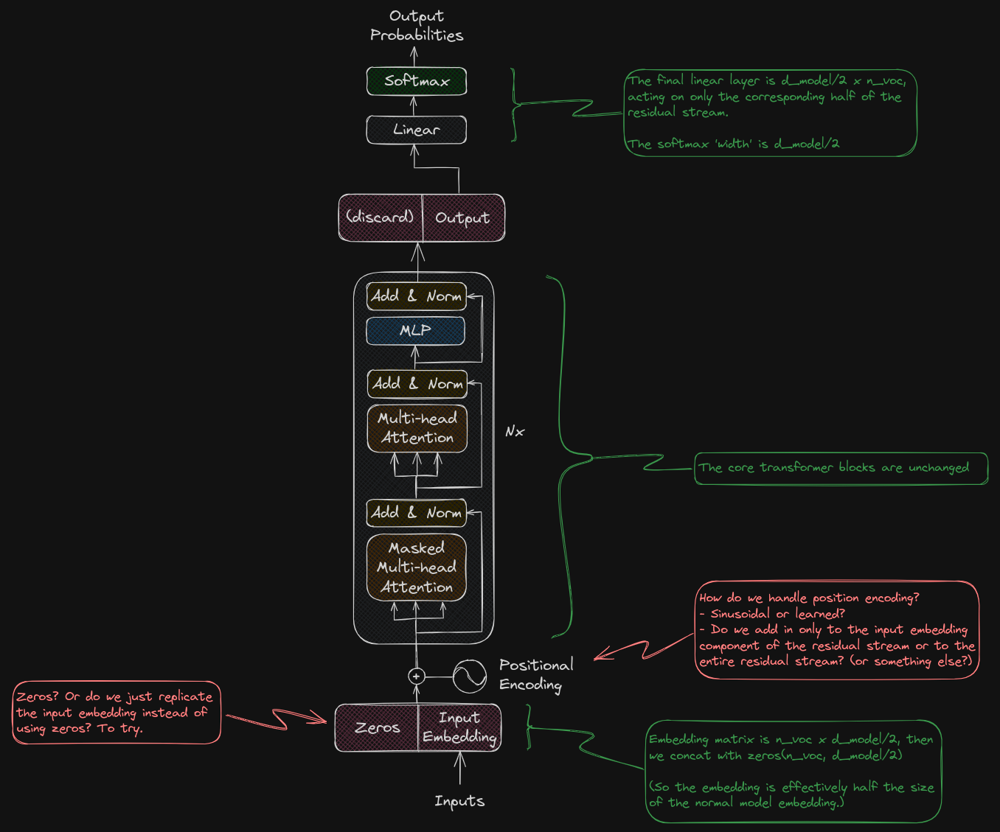

# Residual Stream Data Lane

This repo is the code for a little transformer LLM experiment I did in Dec 2023.

Recent work indicates that the residual stream of the transformer is in part a sort of storage area / scratch pad / communication channel between layers. If this is the case, would it make sense to 'help the model out' by giving it a dedicated area on the residual stream?

Also think about what a language model needs to do: in each sequence position, the residual stream starts with an embedding of a token (in layer 1), and at the end (layer N) it has to turn that position into the embedding for the *next* word in the sequence (either the predicted word, if it is at the end of the sequence, otherwise the next word in the sequence that it does already know). In between the lowest and highest layers, it has to use that space for a bunch of calculations / manipulations. It seems really cumbersome! It obviously works, but could we help the model (either train with less data or maybe with fewer layers or parameters) by making its job easier?

So the basic idea for this experiment is that we have a residual stream that is (say) twice as big as the input / output embeddings, but allow the attention and FFW layers to interact with the *entire* stream (and do with it whatever it wants). In other words, there's some empty space (initialized in the first layer with zeros, so not occupied by embeddings, and unterminated at the last layer) that the model can use for other purposes.

## More info

You can read more (including the results I found) at my blog: https://chrissarmstrong.github.io/seeking-manifold/Experiments/Residual-Stream-Data-Lane

Here's a figure showing the concept:

